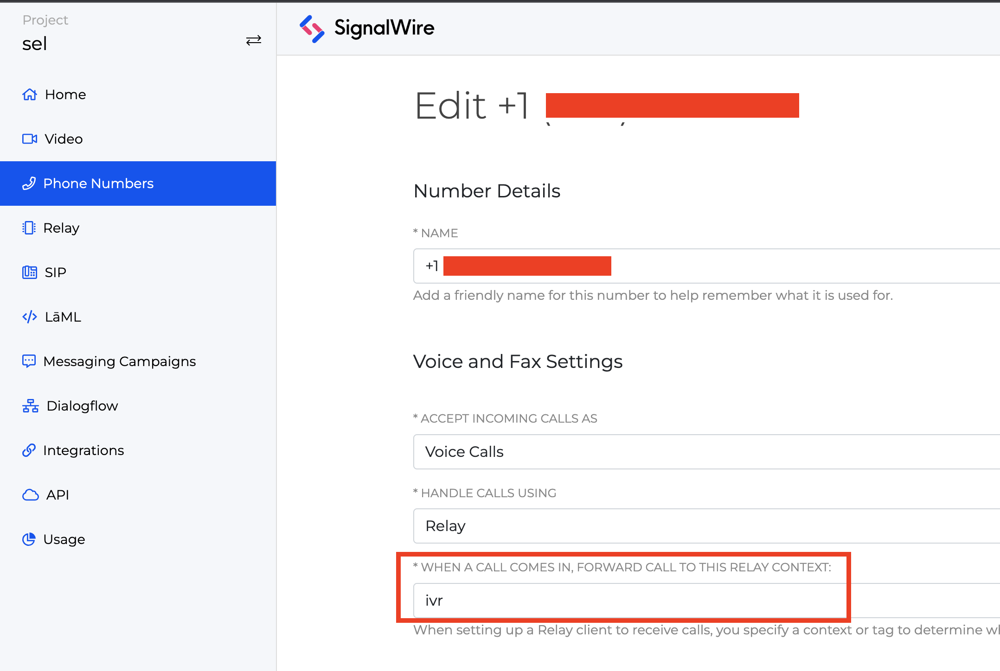

# Interactive Voice Response

This example demonstrates using numerous features of the SignalWire Realtime SDK to create a full featured IVR application.

When the SignalWire number associated with the app is called it will play an mp3 welcome sound and then prompt the user to select an option using the dial pad.

There are three options. Pressing 1 will read out "location and hours" using text to speech. 

Option 2 will allow them to make an appointment by iniating a speech to text prompt. When they finish speaking or press the pound key, the detected text of their speech is written to the console. This can be modified to send that detected text to a spreadsheet or wherever else it may be useful.

Options 3 will read out the options again.

Option 0 will connect the caller to a verified number that you specify. 


## Prerequisites

To run this example you will need to first create a SignalWire account and then configure a SignalWire Space with an inbound phone number and verified outbound phone number to forward to. 

- [Create a SignalWire Space](https://developer.signalwire.com/apis/docs/signing-up-for-a-space)
- [Buy a SignalWire Phone Number](https://developer.signalwire.com/apis/docs/buying-a-phone-number)
- [Setting Up Verified Caller ID for Outbound Calls](https://developer.signalwire.com/apis/docs/caller-id#setting-up-verified-caller-id-for-outbound-calls)

## Configure SignalWire Phone Number to Forward Calls to a context

Once your account, **inbound phone number**, and **verified outbound phone number** are set up. You need to edit the **inbound phone number** to forward calls to the context used by the Relay Consumer in this example, **ivr**.



## API Credentials

To run the example a SignalWire Project ID and API Token are required.
[Follow these intructions to create a new API Token.](https://docs.signalwire.com/topics/relay/#relay-documentation-security)

## Configure Environment Variables File

In the folder for this example create a file named ```.env``

In that file add your credentials as shown:
```
SIGNALWIRE_PROJECT_ID=
SIGNALWIRE_TOKEN=
VERIFIED_NUMBER=+1YOUR-VERIFIED-NUMBER
```

## Running the example

1. Open a terminal and navigate to this directory
```bash
cd /signalwire-relay-examples/node/ivr
```
2. Install the node modules.
```bash
npm install
```
3. Run the consumer.
```bash
npm run start
```

Call the inbound phone number you created in the SignalWire dashboard and follow the instructions on the call. 
You'll be able to see output in the console.