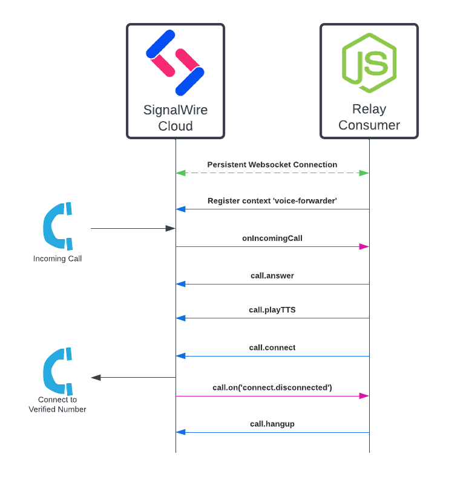
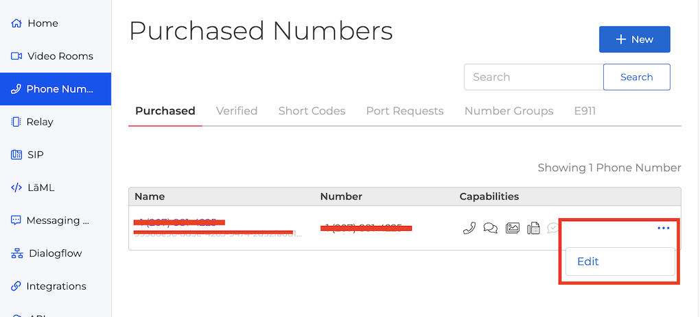
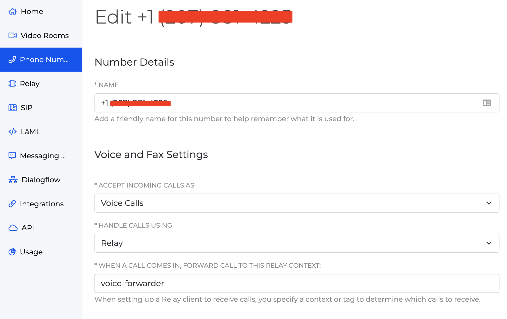

# SignalWire Relay Nodejs SDK Call Forwarder Example



This example will forward all inbound calls to a verified outbound number. 

Before connecting the outbound number, a custom text to speech message is played.  

## Prerequisites

To run this example you will need to first create a SignalWire account and then configure a SignalWire Space with an inbound phone number and verified outbound phone number to forward to. 

- [Create a SignalWire Space](https://developer.signalwire.com/apis/docs/signing-up-for-a-space)
- [Buy a SignalWire Phone Number](https://developer.signalwire.com/apis/docs/buying-a-phone-number)
- [Setting Up Verified Caller ID for Outbound Calls](https://developer.signalwire.com/apis/docs/caller-id#setting-up-verified-caller-id-for-outbound-calls)

## Configure SignalWire Phone Number to Forward Calls to a context

Once your account, **inbound phone number**, and **verified outbound phone number** are set up. You need to edit the inbound phone number to forward calls to the context used by the Relay Consumer in this example, **voice-forwarder**.





## API Credentials

To run the example a SignalWire Project ID and API Token are required.
[Follow these intructions to create a new API Token.](https://docs.signalwire.com/topics/relay/#relay-documentation-security)

## Running the consumer
1. Clone this repository and navigate to this folder.
```bash
git clone https://github.com/signalwire/signalwire-relay-examples.git
cd signalwire-relay-examples/node/voice-forwarder
```
2. Create a file `.env` with your credentials and the verified phone number.
```
SIGNALWIRE_PROJECT_KEY=<Your project id>
SIGNALWIRE_TOKEN=<Your api token>
VERIFIED_NUMBER=+148012345678
```
3. Install the node modules.
```bash
npm install
``` 
4. Run the example.
```bash
npm start
```

## Running the consumer with Docker
```bash
docker build . -t relay-example-node
docker run -e SIGNALWIRE_PROJECT_KEY=<YOUR PROJECT> -e SIGNALWIRE_TOKEN=<YOUR TOKEN> -e VERIFIED_NUMBER=<YOUR-VERIFIED-NUMBER> -e ENABLE_DEBUG=true relay-example-node
```
